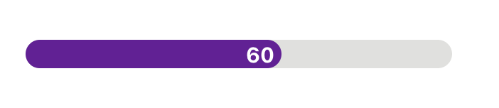
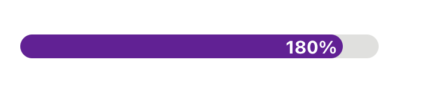
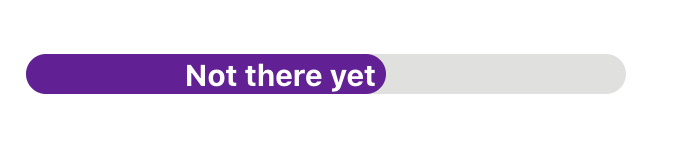
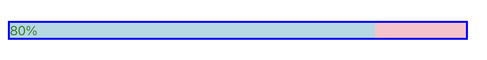

# @ramonak/react-progress-bar

> Progress Bar React Component

[](https://www.npmjs.com/package/@ramonak/react-progress-bar) 

---


---

[Playground / Code Generator](https://katerinalupacheva.github.io/react-progress-bar/)

---

## Install

```bash
npm install --save @ramonak/react-progress-bar
```

## Usage

```jsx
import React from "react";

import ProgressBar from "@ramonak/react-progress-bar";

const Example = () => {
  return <ProgressBar completed={60} />;
};
```

## Examples

### Label without "%" at the end



```jsx

<ProgressBar completed="60">
```

### Max completed value is greater than 100



```jsx
<ProgressBar completed={180} maxCompleted={200} />
```

### Custom Label



```jsx
<ProgressBar completed={60} customLabel="Not there yet" />
```

### Custom class names



```css
//styles.scss

.wrapper {
  border: 3px solid blue;
}

.container {
  background-color: pink;
}

.barCompleted {
  background-color: lightblue;
  width: 80%;
}

.label {
  font-size: 20px;
  color: green;
}
```

```jsx
import './styles.scss'

...

<ProgressBar
  completed={80}
  className="wrapper"
  barContainerClassName="container"
  completedClassName="barCompleted"
  labelClassName="label"
/>
```

## Props

| Name                       | Type                                                           | Default       | Description                                                                                                                   |
| -------------------------- | -------------------------------------------------------------- | ------------- | ----------------------------------------------------------------------------------------------------------------------------- |
| `completed` (required)     | `Number or string`                                             |               | Percentage of completed progress bar value. <br/> If a string, the "%" won't be added to the label. See [Examples](#examples) |
| `maxCompleted`             | `number`                                                       | `100`         | Max possible value of the `completed` prop                                                                                    |
| `customLabel`              | `string`                                                       | undefined     | Custom label                                                                                                                  |
| `bgColor`                  | `string`                                                       | `#6a1b9a`     | Color of the completed bar                                                                                                    |
| `height`                   | `string`                                                       | `20px`        | Height of the bar                                                                                                             |
| `width`                    | `string`                                                       | `100%`        | Width of the bar                                                                                                              |
| `margin`                   | `string`                                                       |               | Margin                                                                                                                        |
| `padding`                  | `string`                                                       |               | Padding                                                                                                                       |
| `borderRadius`             | `string`                                                       | `50px`        | Border radius of the bar                                                                                                      |
| `baseBgColor`              | `string`                                                       | `#e0e0de`     | Color of the "non-completed" bar                                                                                              |
| `labelAlignment`           | `string:` <br/> `left, center, right, outside`                 | `right`       | Position of the label inside the completed bar or outside bar                                                                 |
| `labelColor`               | `string`                                                       | `#fff`        | Color of the label text                                                                                                       |
| `labelSize`                | `string`                                                       | `15px`        | Font-size of the label text                                                                                                   |
| `isLabelVisible`           | `boolean`                                                      | `true`        | Visibility of the label                                                                                                       |
| `transitionDuration`       | `string`                                                       | `1s`          | Duration of the width transition                                                                                              |
| `transitionTimingFunction` | `string:` <br/> `ease, linear, ease-in, ease-out, ease-in-out` | `ease-in-out` | Timing function of the width transition                                                                                       |
| `animateOnRender`          | `boolean`                                                      | false         | Should the bar width be animated on the first render                                                                          |
| `initCompletedOnAnimation`          | `string or number`                                    | 0         | Initial completed value (e.g. the width of the completed bar) on animation start (applies only when `animateOnRender` is true)              |
| `className`                | `string`                                                       |               | Add a `className` to the parent `div` (see [example](#custom-class-names))                                                    |
| `barContainerClassName`    | `string`                                                       |               | Add a `className` to the container `div` (see [example](#custom-class-names))                                                 |
| `completedClassName`       | `string`                                                       |               | Add a `className` to the completed part of the bar (see [example](#custom-class-names))                                       |
| `labelClassName`           | `string`                                                       |               | Add a `className` to the bar label (see [example](#custom-class-names))                                                       |
| `dir`                      | `string:` <br/> `ltr, rtl, auto`                               | `ltr`         | Progressbar HTML direction                                                                                                    |
| `ariaValuemin`             | `number`                                                       | `0`           | accessibility: Defines the minimum allowed value for a range                                                                  |
| `ariaValuemax`             | `number`                                                       | `100`         | accessibility: Defines the maximum allowed value for a range                                                                  |
| `ariaValuetext`            | `number`                                                       | `null`        | accessibility: Defines the human readable text alternative of aria-valuenow (defaults to completed if not passed)             |
| `customLabelStyles`            |  CSS.Properties                                                     |         | custom CSS properties for a label           |

## License

MIT © [KaterinaLupacheva](https://github.com/KaterinaLupacheva)
